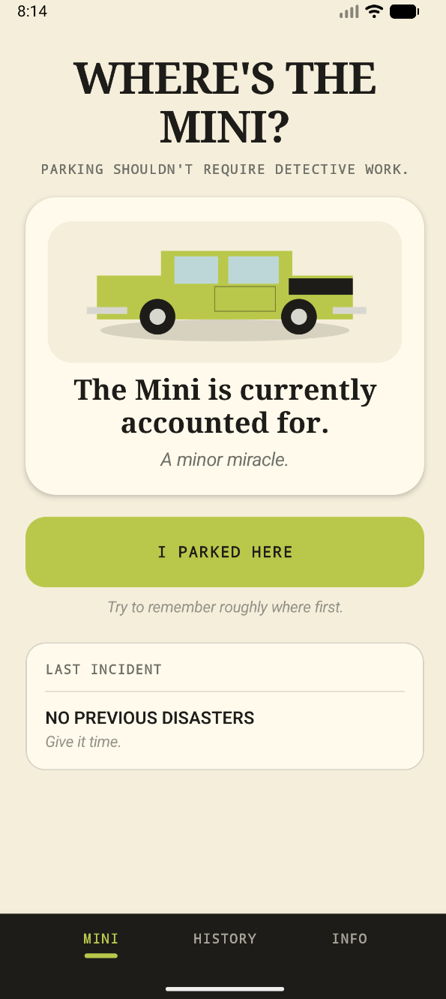
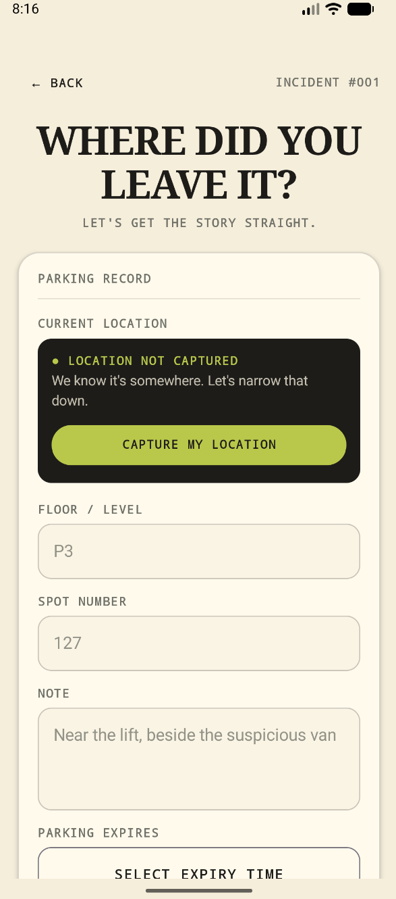
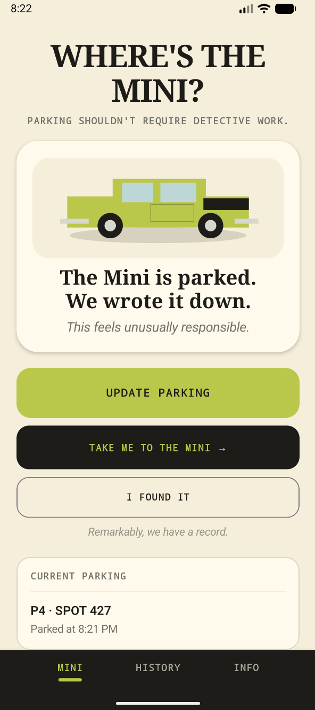
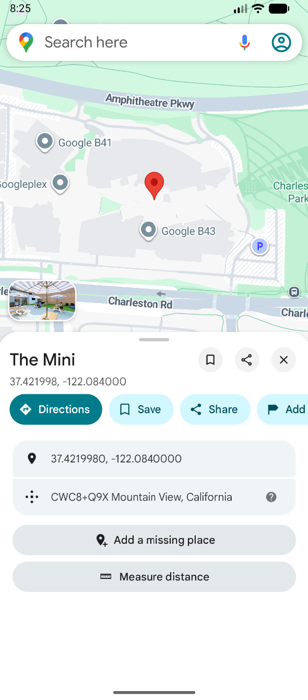
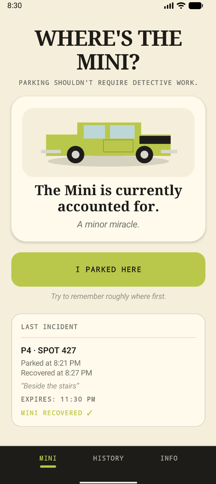
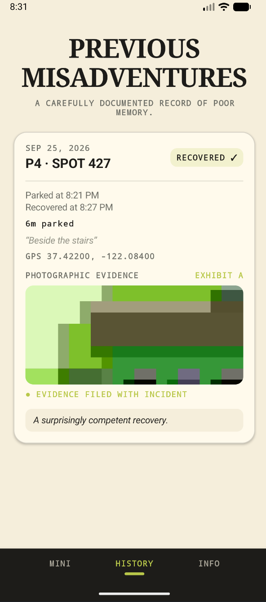
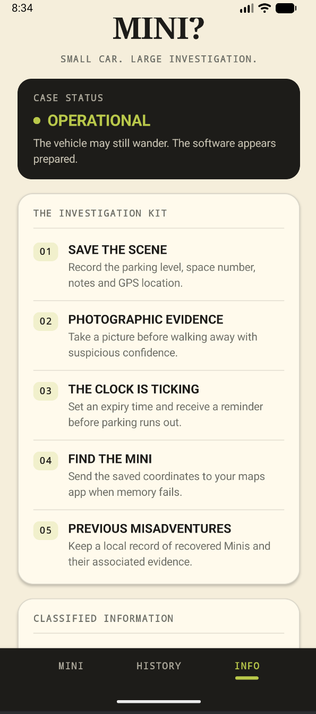

# Where's the Mini?

<p align="center">
  
</p>

<h3 align="center">Parking shouldn't require detective work.</h3>

<p align="center">
  A native Android app for saving where I parked, getting back to the car, and keeping a history of previous parking adventures.
</p>

---

## About the Project

**Where's the Mini?** started with a pretty simple problem:

> Where did I park?

I wanted to build a small Android app around a real everyday problem while having some fun with the presentation.

Instead of trusting my memory, I can create a parking record with the floor, space number, notes, GPS location, expiry time, reminder, and even a photo of where the car was left.

When I need to get back to it, the app can hand the saved coordinates over to a maps app. Once the Mini is recovered, the parking session gets added to the history.

Along the way, the project gave me a chance to work with Kotlin, Jetpack Compose, Room, location services, Android camera integration, notifications, background work, file storage, navigation, and automated testing.

<p align="center">
  
  
  
</p>

---

## Features

### Save Where I Parked

Tapping **I PARKED HERE** opens a parking record where I can save:

- Floor or parking level
- Space number
- Notes or nearby landmarks
- GPS coordinates
- Parking expiry time
- Reminder preference
- Optional photo

<p align="center">
  
</p>

Location capture is optional and only happens when I press the location button.

---

### Persistent Parking Records

Once a parking record is saved, it becomes the active parking session on the home screen.

The data is stored locally with Room, so closing the app or removing it from recent apps does not make the parking record disappear.

<p align="center">
  
</p>

I can also reopen the record and update the parking information without creating a duplicate session.

---

### Take Me to the Mini

If I saved a GPS location, **TAKE ME TO THE MINI** opens the coordinates in an installed maps application.

<p align="center">
  
</p>

I decided not to build navigation from scratch. The app handles remembering the location and lets the phone's existing maps app handle the actual navigation.

---

### Parking Expiry Reminders

A parking expiry time can be attached to a parking record.

If reminders are enabled, the app schedules a notification before the parking session expires.

Example:

> **The clock is ticking.**  
> P2 · Spot 134. Your parking expires soon.

The reminder system uses Android notifications and WorkManager, so the app does not need to stay open.

---

### Photographic Evidence

Sometimes a floor and parking-space number still aren't enough.

The app can open the Android camera and attach a photo to the current parking record.

Photos can be:

- Captured
- Previewed
- Retaken
- Removed
- Saved with the parking record
- Viewed later in parking history

The image files are stored locally in app-specific storage.

---

### I Found It

Once I make it back to the car, **I FOUND IT** closes the active parking session and records when the Mini was recovered.

<p align="center">
  
</p>

The home screen then goes back to its ready state while keeping the last incident available.

---

### Previous Misadventures

Completed parking sessions are kept in the **History** section.

Each record can contain:

- Date
- Floor and space number
- Time parked
- Recovery time
- Total parking duration
- Notes
- GPS coordinates
- Parking photo
- Recovery status

<p align="center">
  
</p>

Over time, it becomes a small record of how often finding the Mini turned into an investigation.

---

### Case File

The **Info** screen explains what the app can do and gives a quick look at the technology behind it.

<p align="center">
  
</p>

---

## App Flow

```text
WHERE'S THE MINI?
        │
        ▼
   I PARKED HERE
        │
        ▼
┌──────────────────────────┐
│ Create Parking Record    │
├──────────────────────────┤
│ Floor / Level            │
│ Space Number             │
│ Notes                    │
│ GPS Coordinates          │
│ Expiry Time              │
│ Reminder                 │
│ Photograph               │
└──────────────────────────┘
        │
        ▼
   SAVE THE MINI
        │
        ▼
 Active Parking Record
        │
        ├─────────────────────────┐
        │                         │
        ▼                         ▼
 UPDATE PARKING          TAKE ME TO THE MINI
                                  │
                                  ▼
                           Maps Application
        │
        ▼
    I FOUND IT
        │
        ▼
 Recovered Incident
        │
        ▼
PREVIOUS MISADVENTURES
```

---

## Built With

### Android

- Kotlin
- Jetpack Compose
- Material 3
- Android SDK
- Compose Navigation

### Architecture

- MVVM
- ViewModel
- Repository pattern
- Separate presentation, domain, and data layers

### Local Storage

- Room
- DAO-based database access
- Database migrations
- Persistent active parking sessions
- Parking history
- Persistent photo paths

### Location

- Google Play Services Location
- Fused Location Provider
- Runtime location permissions
- Latitude and longitude storage

### Camera & Files

- Android camera intents
- FileProvider
- App-specific image storage
- Persistent parking photographs

### Notifications

- WorkManager
- Scheduled parking reminders
- Android notifications
- Runtime notification permissions

### Navigation

- Compose Navigation
- Bottom navigation
- External maps intents

### Testing

- JVM unit tests
- Android instrumented tests
- ViewModel tests
- Room and repository persistence tests
- Gradle build verification

---

## Project Structure

```text
app/src/main/java/com/danielguillaumont/wheresthemini/
│
├── data/
│   ├── local/
│   │   ├── ParkingDao.kt
│   │   ├── ParkingEntity.kt
│   │   └── WheresTheMiniDatabase.kt
│   │
│   ├── location/
│   │   └── FusedLocationClient.kt
│   │
│   ├── navigation/
│   │   └── MapNavigator.kt
│   │
│   ├── notification/
│   │   ├── NotificationHelper.kt
│   │   ├── ParkingReminderScheduler.kt
│   │   └── ParkingReminderWorker.kt
│   │
│   ├── photo/
│   │   └── ParkingPhotoManager.kt
│   │
│   └── repository/
│       └── ParkingRepository.kt
│
├── domain/
│   └── model/
│       └── ParkingSession.kt
│
└── presentation/
    ├── components/
    │   └── MiniBottomNavigation.kt
    │
    ├── history/
    │   └── HistoryScreen.kt
    │
    ├── home/
    │   └── HomeScreen.kt
    │
    ├── info/
    │   └── InfoScreen.kt
    │
    ├── navigation/
    │   └── AppNavigation.kt
    │
    └── parking/
        ├── ParkingViewModel.kt
        ├── ParkingViewModelFactory.kt
        └── SaveParkingScreen.kt
```

---

## Architecture

The app uses a lightweight layered architecture so the UI, application state, and persistence logic aren't all mixed together.

```text
┌───────────────────────────────┐
│        Jetpack Compose        │
│            UI Layer           │
└──────────────┬────────────────┘
               │
               ▼
┌───────────────────────────────┐
│       ParkingViewModel        │
│       Application State       │
└──────────────┬────────────────┘
               │
               ▼
┌───────────────────────────────┐
│      ParkingRepository        │
│         Data Access           │
└──────┬────────┬───────┬───────┘
       │        │       │
       ▼        ▼       ▼
     Room    Location  Photos
       │        │       │
       └────────┴───────┘
               │
               ▼
         Android Platform
```

The Compose screens handle presentation and interaction while the repository and supporting data classes handle persistence and Android-specific functionality.

---

## Local-First

I kept the app local-first on purpose.

There is no account, cloud database, or backend required.

The device stores:

- Parking records
- Parking history
- GPS coordinates
- Notes
- Expiry information
- Reminder settings
- Photo file references

Location is only captured when requested.

Parking photos stay in app-specific storage, and navigation is handed off to the installed maps application.

---

## Testing

I added both local unit tests and Android instrumented tests instead of relying only on manual testing.

### Unit Tests

Run the local test suite with:

```powershell
.\gradlew.bat testDebugUnitTest
```

The unit tests cover ViewModel and parking-state behaviour.

### Instrumented Tests

Run the Android tests with:

```powershell
.\gradlew.bat connectedDebugAndroidTest
```

These tests exercise Room and repository behaviour on an Android emulator or physical device.

Tested scenarios include:

- Saving parking data
- Reading saved parking data
- Updating an existing parking session
- Preserving parking history
- Recovering a parking session
- Persisting parking metadata
- Room-backed repository behaviour

### Build

Create a debug build with:

```powershell
.\gradlew.bat assembleDebug
```

The current project passes the unit tests, instrumented tests, and debug build.

---

## Running the Project

### Requirements

- Android Studio
- Android SDK
- Android 8.0 / API 26 or newer
- Compatible JDK
- Android emulator or physical Android device

### Clone

```bash
git clone https://github.com/danielguillaumont/wheres-the-mini.git
cd wheres-the-mini
```

Open the project in Android Studio and let Gradle sync.

Then select an emulator or connected Android device and run the `app` configuration.

---

## Useful Commands

Build the debug APK:

```powershell
.\gradlew.bat assembleDebug
```

Run unit tests:

```powershell
.\gradlew.bat testDebugUnitTest
```

Run Android instrumented tests:

```powershell
.\gradlew.bat connectedDebugAndroidTest
```

Run a clean build:

```powershell
.\gradlew.bat clean assembleDebug
```

---

## Version 1.0

The first version includes:

- [x] Native Kotlin Android app
- [x] Jetpack Compose UI
- [x] MVVM architecture
- [x] Parking record creation
- [x] Parking record updates
- [x] GPS location capture
- [x] Runtime location permissions
- [x] Room database
- [x] Database migrations
- [x] Persistent parking state
- [x] Parking history
- [x] Recovery workflow
- [x] Maps integration
- [x] Parking expiry times
- [x] WorkManager reminders
- [x] Android notifications
- [x] Runtime notification permissions
- [x] Camera integration
- [x] Persistent parking photographs
- [x] Photo retake and removal
- [x] Custom launcher icon
- [x] Unit tests
- [x] Android instrumented tests
- [x] Case file / info screen

---

## Screenshots

| Home | Save Parking | Active Parking |
|:---:|:---:|:---:|
|  |  |  |

| Map Handoff | Mini Recovered | History |
|:---:|:---:|:---:|
|  |  |  |

<p align="center">
  <strong>Case File</strong><br><br>
  
</p>

---

## Why I Built It

I wanted a small Android project that solved an actual everyday problem without turning into another generic portfolio app.

I also liked the idea of treating something as simple as forgetting where I parked like a full detective investigation.

That gave me a fun reason to work with real Android features including GPS, Room persistence, camera access, local file storage, notifications, background work, external intents, navigation, and automated testing while still giving the app its own personality.

---

## Possible Next Steps

There are still a few things I could add later:

- Address lookup from saved coordinates
- Better camera controls
- More reminder options
- Search and filtering for parking history
- Parking statistics
- History deletion controls
- Shareable parking records
- More accessibility and UI testing
- Release packaging

For now, Version 1.0 covers the full parking workflow I originally wanted to build.

---

## Author

**Daniel Guillaumont**

---

<p align="center">
  <strong>WHERE'S THE MINI? · CASE FILE #001</strong>
</p>

<p align="center">
  <em>Small car. Large investigation.</em>
</p>

<p align="center">
  Parking shouldn't require detective work.
</p>